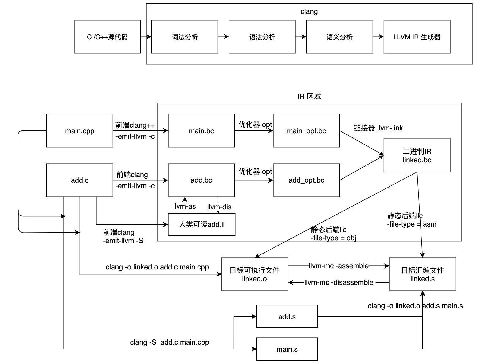

Sphinx语法简介
===============

本文介绍Sphinx所使用的reStructuredText基础语法，这里描述了写文档时常用的语法。参考文档《sphinx-doc-org-en-master.PDF》第四章内容。

reStructuredText大部分语法与markdown下语法相同。

.. _first_section:

段落层次
-----------
* ``#`` with overline, for parts
* ``*`` with overline, for chapters
* ``=`` for sections
* ``-`` for subsections
* ``^`` for subsubsections
* ``"`` for paragraphs

文本强调
----------
*斜体*

**粗体**

``行内代码``

列表
--------------
注意rst语法使用空行来进行段落区分，或者使用`|`符号进行分段换行，具体请看下面的示例。

此外，由于rst最早用于python的文档生成，因此和python一样对缩进非常敏感。

* 列表1
* 列表2

  * 子列表1
  * 子列表2

| 1.带序号的列表 
| 2.带序号的列表

#. 带序号的列表
#. 带序号的列表

term 2
    | Definition 2, paragraph 1.
    | Definition 2, paragraph 2.

引用
----------
代码引用段示例如下

.. code-block:: python

    def my_function(x, y):
        """
        This is a function that multiplies two numbers.

        :param x: The first number.
        :param y: The second number.
        :return: The product of x and y.
        """
        return x * y

段落引用::

    This is a paragraph that is being quoted.

    It can span multiple lines.

引用文本会利用缩进来区分。其中 ``::`` 的使用有几种场景：另起一行；接在文字后面；接在空格后面，可以看以下两个例子比较效果。

段落引用
::

    这是被引用的段落

段落引用 ::

    这是被引用的段落

能看到 ``段落引用`` 后面的冒号消失。

命令行引用，源于python的doctest

>>> 1 + 1
2

可以方便地展示程序运行结果。

表格和图片
------------

表格
^^^^

完整的表格

注意表格的线需要严格对齐，否则编译会报错。

+-------------------------+-----------+-----------+-----------+
|  Header row, column 1   | Header 2  | Header 3  | Header 4  |
+=========================+===========+===========+===========+
| body row 1, column 1    | column 2  | column 3  | column 4  |
+-------------------------+-----------+-----------+-----------+
| body row 2              | ...       | ...       |           |
+-------------------------+-----------+-----------+-----------+

简化的表格

===== =====
A     B
===== =====
False False
True  False 
False True 
True  True
===== =====

带标题和格式的表格

.. table:: A simple table with a title and formatting
   :width: 70%
   :widths: auto
   :align: center

   +-----+-----+
   | A   | B   |
   +=====+=====+
   | 1   | 2   |
   +-----+-----+
   | 3   | 4   |
   +-----+-----+

图片
^^^^^^
一张图片的示例如下：

   标题： LLVM tools around IR

链接跳转
--------------
以下是网页链接,注意text和链接中间需要有空格，最后有后缀的下划线。

`Link text <https://domain.invalid/>`_

文件跳转链接使用 ``:ref:`` 关键字，参考段落 :ref:`first_section`，注意在label生成时的前缀下划线。
同样的语法可用于生成对图片的引用。

对脚注和参考文献的引用 [#label]_ 。注意引用前后的空格，以及后缀的下划线。

参考文献
^^^^^^^^

.. rubric:: Footnotes

.. [1] A footnote contains body elements, consistently indented by at
   least 3 spaces.

   This is the footnote's second paragraph.

.. [#label] Footnotes may be numbered, either manually (as in [1]_) or
   automatically using a "#"-prefixed label.  This footnote has a
   label so it can be referred to from multiple places, both as a
   footnote reference ([#label]_) and as a hyperlink reference
   (label_).

.. [#] This footnote is numbered automatically and anonymously using a
   label of "#" only.

.. [*] Footnotes may also use symbols, specified with a "*" label.
   Here's a reference to the next footnote: [*]_.

文中提示
----------
.. Attention:: Directives at large.

.. Caution:: Don't take any wooden nickels.

.. DANGER:: Mad scientist at work!

.. Error:: Does not compute.

.. Hint:: It's bigger than a bread box.

.. Important::
   - Wash behind your ears.
   - Clean up your room.

     - Including the closet.
     - The bathroom too.

       - Take the trash out of the bathroom.
       - Clean the sink.
   - Call your mother.
   - Back up your data.

.. Note:: This is a note.
   Equations within a note:
   :math:`G_{\mu\nu} = 8 \pi G (T_{\mu\nu}  + \rho_\Lambda g_{\mu\nu})`.

.. Tip:: 15% if the service is good.

    +---------+
    | Example |
    +=========+
    | Thing1  |
    +---------+
    | Thing2  |
    +---------+
    | Thing3  |
    +---------+

.. WARNING:: Strong prose may provoke extreme mental exertion.
   Reader discretion is strongly advised.

可以自定义提示信息。

文档注释

.. 注释
   注释第二行

只需在注释前加上 ``..`` 即可。

API特殊处理
--------------
用于漂亮地展示代码API。

.. cpp:type:: MyType

   Some type

.. cpp:function:: const MyType Foo(const MyType bar)

   Some function type thing

.. cpp:class:: template<typename T, std::size_t N> std::array

   Some cpp class

.. cpp:member:: float Sphinx::version

   The description of Sphinx::version.

.. cpp:var:: int version

   The description of version.

.. class:: payments.dotpay.DotpayProvider(seller_id, pin[, channel=0[, lock=False], lang='pl'])

   This backend implements payments using a popular Polish gateway, `Dotpay.pl <http://www.dotpay.pl>`_.

   Due to API limitations there is no support for transferring purchased items.

   :param seller_id: Seller ID assigned by Dotpay
   :param pin: PIN assigned by Dotpay
   :param channel: Default payment channel (consult reference guide)
   :param lang: UI language
   :param lock: Whether to disable channels other than the default selected above

或者单独描述某些参数

:param seller_id: Seller ID assigned by Dotpay
:type seller_id: str
:fieldname: Field description
